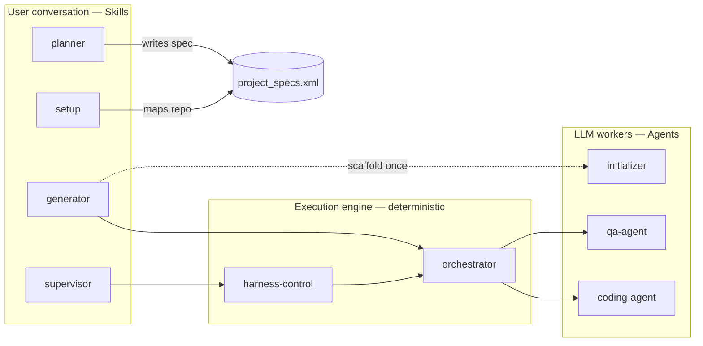
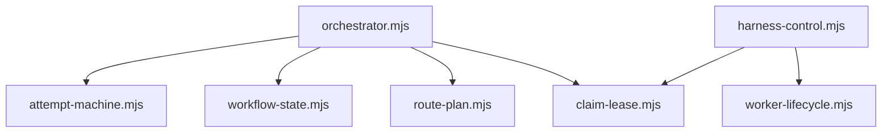

# Harness Workflow

The harness turns a **Project Goal** into independently checked work while keeping enough durable state for another session to continue safely.

## Bounded contexts

Four contexts matter.
Only the **workflow pipeline** is required to deliver software; the others are optional packaging or control surfaces.

| Context | What lives here | You interact through |
| --- | --- | --- |
| **Plugin marketplace** | `install.sh`, manifests, host configuration | Installer checklist |
| **Workflow pipeline** | `project_specs.xml`, `feature_list.json`, `orchestrator.mjs`, `workflow/attempt-machine.mjs`, `lib/claim-lease.mjs` (CLI: `claim.sh` / `claim.ps1`), Goal Review policy | Skills below + files in your repo |
| **Supervisor control** | `harness-control.mjs`, Resource Governor, Control Events, Input Requests | `/harness:supervisor` |
| **Optional routing** | `.harness/roles.json`, MCP servers | `config/roles.example.json` |

**Skills** (under `skills/`) are what **you** type in chat — planner, setup, generator, supervisor, evaluator.
They prepare specs, start runs, or relay progress.
They do not replace the orchestrator.

**Agents** (under `agents/`) are what the **orchestrator** spawns per phase — coding-agent, qa-agent, initializer.
You do not invoke them directly; the state machine selects them from `roles.json` or the active host.

### Generator modules (deterministic, no LLM)

Orchestrator owns host adapters and Goal Review; the Attempt loop and shared policy live in libraries so supervisor and orchestrator stay aligned without duplicating execution rules.

## Language

**Project Goal**:
The observable outcome defined by `project_specs.xml` that the workflow must deliver.
_Avoid_: Task list, feature flags

**Acceptance Check**:
A stable, traceable statement of observable behavior that proves part of the Project Goal.
_Avoid_: Feature, test case, task

**Work Item**:
An executable unit derived from one or more Acceptance Checks and tracked in `feature_list.json`.
_Avoid_: Acceptance Check, Project Goal

**Completion Contract**:
The Project Goal is complete only when every Acceptance Check passes against the integrated plan branch and a final system-level verification passes.
_Avoid_: All flags are true

**Defect Report**:
A QA handoff describing observed behavior, expected behavior, reproduction evidence, and the affected Acceptance Checks.
_Avoid_: QA response, failure message

**Repair Plan**:
The orchestrator's persisted diagnosis and bounded instructions for the next coding run after a Defect Report.
_Avoid_: Retry prompt, QA notes

**Attempt**:
One coding, isolated-QA, and—when reached—Integrated Verification cycle for a Work Item.
_Avoid_: Agent invocation, tool retry

**Blocked Work Item**:
A Work Item that has failed QA after three Attempts and requires user direction, with its Defect Reports, Repair Plans, and current state preserved.
_Avoid_: Failed task, abandoned task

**Run State**:
The atomically updated machine-readable snapshot of one active context, including ownership, liveness, phase, Attempt, last result, and next action.
_Avoid_: Log, progress notes, status file

**Workflow Journal**:
The concise, human-readable history of meaningful workflow transitions and handoffs for one context.
_Avoid_: Transcript, raw agent output, status file

**Evidence Artifact**:
A separately stored screenshot, HTTP result, command output, or runtime log referenced by a Workflow Journal entry or Defect Report.
_Avoid_: Journal entry, conversation log

**Claim Lease**:
Exclusive ownership of a context, proven by an owner identity and liveness data in its Run State.
_Avoid_: Lock file, task assignment

**Resume**:
Atomic acquisition of an abandoned Claim Lease followed by continuation from the Run State's recorded next action in the existing worktree.
_Avoid_: Restart, rerun

**Checkpoint**:
A Work Item whose isolated QA has passed and whose committed changes are ready for integration with the latest plan integration branch.
_Avoid_: Context completion, QA pass

**Integrated Verification**:
Black-box execution of a Checkpoint's mapped Acceptance Checks after its changes are combined with the latest integration branch (never `main` while a plan is in flight).
_Avoid_: Branch QA, merge check

**Goal Review**:
The mandatory independent, system-level verification of the Project Goal on the integrated plan branch after the work queue is empty.
_Avoid_: Evaluator sweep, final QA, queue completion

**Plan integration branch**:
The long-lived Git branch that owns a Project Goal's integrated queue and merges (for example `plan/opensource-docker`).
Side Work Items branch from it as `gen/*` and merge back into it only.
Pin it in `.harness/integration-branch` at the repo root.
_Avoid_: main, master, feature branch

**Dependency Graph**:
The acyclic relationships between Acceptance Checks that determine when their Work Items are eligible to run.
_Avoid_: Foundation phase, execution order

**Ready Work Item**:
A queued Work Item whose mapped Acceptance Check dependencies have all passed Integrated Verification.
_Avoid_: Pending task, next feature

**Skill**:
A user-invoked harness command (`/harness:planner`, `/harness:generator`, …) defined under `skills/<name>/SKILL.md`.
_Avoid_: Agent, plugin command, slash command for workers

**Agent**:
An orchestrator-spawned executor with a fixed JSON contract (`agents/coding-agent.md`, `agents/qa-agent.md`, `agents/initializer.md`).
_Avoid_: Skill, subagent, chat session

**Initializer**:
The scaffold-only agent that maps stable Acceptance Checks into `feature_list.json`, creates a PORT-parameterized `init.sh` and project structure, and makes the first commit on `main`. Idempotent; never implements Work Items.
_Avoid_: Code Agent, generator skill

**Supervisor**:
The single long-lived control loop per project (`harness-control.mjs`) that admits workers, relays Control Events, and escalates Input Requests without owning execution policy.
_Avoid_: worker, scheduler, generator skill

**Orchestrator**:
The deterministic entry point (`orchestrator.mjs`, no LLM) that delegates the Attempt loop to `attempt-machine.mjs`, runs Goal Review, and owns host adapters plus `roles.json` routing and Demotion.
_Avoid_: Supervisor, LLM planner

**Input Request**:
A durable, uniquely identified request for user direction that records why work cannot proceed, permitted actions, and supporting evidence.
_Avoid_: Alert, log message, chat question

**Resource Governor**:
The deterministic admission policy that limits new workers to the minimum capacity allowed by configured concurrency, CPU, free memory, current load, and provider quota state.
_Avoid_: Agent judgment, scheduler prompt, worker pool

**Supervisor Lease**:
Atomic singleton ownership of one repository's Resource Governor, stored in its shared Git directory and refreshed by heartbeat.
_Avoid_: Context Claim Lease, PID file, chat session

**Control Event**:
A durable, ordered machine-readable record of a meaningful supervisor transition that a Supervisor can relay or summarize.
_Avoid_: Transcript, console output, notification

**Blocking Scope**:
The smallest execution boundary stopped by a failure: one context by default, or the entire Project Goal only when shared safety, specification, or infrastructure prevents useful independent work.
_Avoid_: Global pause, failed task

**Verify-First Mode**:
A spec mode (`<mode>existing-codebase</mode>`) where coding agents first exercise the Acceptance Checks against existing code at a real external boundary, set `implementation=true` with no code changes when they pass, and only repair the root cause with the smallest possible diff when a check fails. QA and Integrated Verification still independently re-run the checks. Turns `/generator` into a safe audit pass over a working codebase rather than a rewrite.
_Avoid_: Audit mode, verify-only mode, read-only generator

**User**:
The human who sets up the harness, requests features or refactors, answers escalations, and reads relayed progress.
_Avoid_: operator, client

**Code Agent**:
The coding executor (`agents/coding-agent.md`) selected by `roles.json` `coding` routing, responsible for implementing one Work Item.
_Avoid_: QA Agent, generator skill

**QA Agent**:
The validation executor (`agents/qa-agent.md`) selected by `roles.json` `validation` routing and run independently of the Code Agent, so the reviewer is never the coder.
_Avoid_: Code Agent, self-review

**Strike Count**:
A per-project-run integer that increases by one on a qualifying failure (infrastructure or quality) and decreases by one on a clean success, with a floor of zero. Infrastructure strikes keyed by `(harness, model)` apply globally across roles; quality strikes keyed by `(role, harness, model)` stay local.
_Avoid_: retry counter, error log

**Demotion**:
Sorting a struck candidate to the back of its role list at selection time.
_Avoid_: ban, removal

**Repair Budget**:
The number of QA rejections allowed on one Work Item before switching to the next coder; set by `HARNESS_REPAIR_BUDGET`, default 2.
_Avoid_: Attempt limit, retry cap

**noCredits tier**:
An optional free fallback list in `roles.json`, reached only when paid candidates are exhausted by infrastructure or credit errors.
_Avoid_: free tier default, primary route
