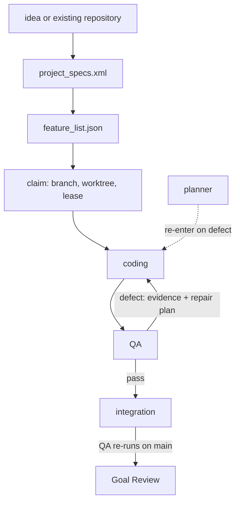

<p align="center">
  
</p>

<p align="center">
  <a href="https://github.com/vinicius91carvalho/harness-engineering/releases/latest"></a>
  <a href="https://github.com/vinicius91carvalho/harness-engineering"></a>
  <a href="https://github.com/vinicius91carvalho/harness-engineering/releases"></a>
</p>

<p align="center"><b>A durable spec → build → QA workflow for AI coding tools.</b></p>

## Quickstart

The whole thing in four steps — each one is explained in full further down.

**1. Install** (macOS, Linux, Git Bash, or WSL) — requires `jq`. A menu appears: keep `harness` checked (up/down to move, space to toggle, enter to confirm).
```sh
curl -sSL https://raw.githubusercontent.com/vinicius91carvalho/harness-engineering/main/install.sh | sh
```

Steps 2 and 3 are typed **inside your coding tool's chat** (Claude Code, Codex,
or OpenCode) — not in a terminal:

**2. Describe** what you want, in plain language.
```text
/harness:planner Build a notes app where a user can publish a note and find it after reloading.
```

**3. Build** it. Generator asks what to build — answer "All" for a new project.
```text
/harness:generator
```

**4. Done** is when the Goal Review passes and every check is marked complete —
not when the chat runs quiet. The sections below explain each step and how to
watch, resume, or fix a run.

## About

`harness-engineering` is a plugin marketplace and a complete software-delivery
workflow. It turns a project goal into stable Acceptance Checks, bounded work,
independent QA, integrated verification, and a final Goal Review. Its state lives
in repository and Git files, so work can survive retries, parallel workers, tool
changes, and lost conversations.

[Claude Code](https://code.claude.com/docs/en/overview),
[Codex](https://developers.openai.com/codex/), and
[OpenCode](https://opencode.ai/) are interactive tools that can run the harness.
Pi is a fourth, headless harness: the orchestrator can dispatch work to it
directly (`--host pi`), and it can also run as the Omnigent supervisor relay
for small-context hosts. [Omnigent](https://omnigent.ai/) is another optional
tool: it provides a control surface and routes work between those coding
tools. None of them replaces the harness workflow.

### Bounded contexts

Four independent pieces make up this repository. Only the second is required;
the rest are optional and can be added, removed, or ignored without affecting
the others:

| Context | What it is | Required? |
| --- | --- | --- |
| **Plugin marketplace** | `install.sh`/`install.ps1` and the marketplace manifests that put harness commands, skills, and other listed plugins into Claude Code, Codex, or OpenCode. | Yes, to install anything. |
| **Spec → build → QA → Goal Review pipeline** | The harness workflow itself: `project_specs.xml`, `feature_list.json`, the orchestrator, and Goal Review. This is "the harness." | Yes, this is the product. |
| **Omnigent agent bundle** | An optional control surface and tool/model router (`omnigent/harness-engineering/`) that starts the harness and routes work across candidate models, including open-source ones. The installer copies the orchestrator (`harness-control.mjs` + generator scripts) alongside the bundle so the supervisor can call it from a known path. | No, direct tool execution works without it. |
| **MCP servers** | Optional Model Context Protocol integrations (e.g. `codebase-memory-mcp`, Bright Data, Playwright) configured per host and backed up sanitized into `config/mcp.json`. | No, unrelated to whether the pipeline runs. |

### Why use it?

Long AI coding jobs tend to lose the plot: the context resets, a retry quietly
undoes good work, or the tool declares itself finished when it isn't. The harness
keeps a durable, checkable record so "done" means the work actually passes.

- **The specification decides completion.** Agent confidence and an empty task
  list are not proof.
- **Coding and QA are separate.** The implementation tool does not approve its
  own work when another tool is available.
- **Integration is verified.** Checks run in the worker branch and again after
  merging into current `main`.
- **Failures are actionable.** Evidence and a fix plan are recorded before a
  bounded retry.
- **State is durable.** Claims, attempts, evidence, and pending input survive
  sessions and context resets.
- **Parallel work is governed.** Dependencies, claims, resource limits, and
  serialized merges prevent workers from colliding.
- **Tools are replaceable.** The same workflow runs through Claude Code, Codex,
  OpenCode, Pi, or optional Omnigent routing.

## Framework

The harness exposes workflow and support commands:

| Task | Claude Code / Codex | OpenCode | Purpose |
| --- | --- | --- | --- |
| Set up existing code | `/harness:setup` | `/harness-setup` | Map an existing codebase and create its harness files. Takes no arguments. |
| Plan new work | `/harness:planner` | `/harness-planner` | Turn a new product idea into `project_specs.xml`. |
| Build or resume | `/harness:generator` | `/harness-generator` | Reconcile, build, independently test, integrate, retry, and resume work. |
| Review the goal | `/harness:evaluator` | `/harness-evaluator` | Run an independent Goal Review against integrated `main`. |
| Operate supervisor | `/harness:supervisor` | `/harness-supervisor` | Run and operate the detached supervisor. |
| Capture lessons | `/harness:learning-loop` | `/harness-learning-loop` | Convert useful session lessons into reusable harness improvements. |
| Back up configuration | `/harness:update-project` | `/harness-update-project` | Back up sanitized host configuration into this repository. |

Examples below use the colon form (Claude Code/Codex); OpenCode uses the hyphen form shown above.

Planner uses the bundled grilling skill internally; it is not a separate harness
workflow command. A user can still activate an installed grilling skill directly
by asking “grill me.”



### Layers

| Layer | Role |
| --- | --- |
| User | The human: sets up the project, requests features or refactors, answers escalations, and reads progress. |
| Initializer | The scaffold-only agent (`agents/initializer.md`) that maps stable Acceptance Checks into `feature_list.json`, creates a PORT-parameterized `init.sh` and project structure, and makes the first commit on `main`. Idempotent; never implements Work Items. |
| Supervisor | The single long-lived agent per project (engine: `harness-control.mjs`). Launched via `omni run <bundle> --harness <tool>`; collects state, relays events to the user, and escalates judgment. |
| Orchestrator | The deterministic per-Work-Item state machine (`orchestrator.mjs`, no LLM) that sequences coding → QA → integration → Goal Review and routes models via `roles.json`. |
| Code Agent / QA Agent | The per-role executor models from `roles.json` (`coding` / `validation`) that implement and independently verify each Work Item. |
| Goal Review agent | The per-role executor model from `roles.json` (`goalReview`) that independently reruns every Acceptance Check against integrated `main` after the work queue is empty, without modifying product code. |

See [CONTEXT.md](CONTEXT.md) for the full glossary.

## How the workflow runs

1. **Specify:** planner or setup writes one Project Goal and observable,
   dependency-aware Acceptance Checks in `project_specs.xml`.
2. **Reconcile:** generator maps every check to an append-only Work Item in
   `feature_list.json`. Missing mappings block execution.
3. **Claim:** each ready context receives an atomic lease, its own Git branch and
   worktree, a port (so parallel dev servers don't clash), and durable Run State.
4. **Build and inspect:** a coding tool implements the Work Item; independent QA
   exercises the result through a browser or real HTTP boundary.
5. **Repair:** a defect records expected and observed behavior, evidence, and a
   Repair Plan. Three failed coding → QA → integration attempts require input.
6. **Integrate:** passing work merges into current `main`, then the same checks
   run against the combined product.
7. **Review the goal:** after all Work Items integrate, an independent Goal
   Review runs the whole specification. Only its completed Run State and a
   persisted `run_completed` event prove completion.

Multiple generator sessions may claim independent contexts concurrently. A new
session resumes durable state rather than restarting the project.

### Key terms

| Term | Meaning |
| --- | --- |
| Work Item | One Acceptance Check being implemented and QA'd; an entry in `feature_list.json`. |
| Acceptance Check | A stable, ID'd pass/fail contract in `project_specs.xml`. |
| Context | A group of related Acceptance Checks claimed and built together. |
| Lease | A heartbeat-timestamped claim that stops two sessions building the same context. |
| Run State | Durable JSON tracking one context's phase, attempt, and next action. |
| Repair Plan | The orchestrator's fix plan issued after a QA defect, before the next attempt. |
| Goal Review | The final independent check of the whole Project Goal on integrated `main`. |
| Supervisor | The single long-lived agent per project, chosen via `omni run --harness <tool>` (claude, codex, or pi), that governs worker admission, relays status to the user, and escalates judgment. Engine: `harness-control.mjs`. |

Retries operate at three layers, not a contradiction: the orchestrator allows
3 attempts per Work Item before blocking; the supervisor's retry queue
(`harness-control.mjs`) retries a blocked claim up to 5 times before it asks
for input; Goal Review reopens a Work Item at most 2 times (`retries >= 2`
exhausts it) before it blocks for guidance.

The worker lease clock (`HARNESS_LEASE_TIMEOUT_SECONDS`, default 60s, in
`claim.sh`) and the supervisor's external-worker staleness check
(`lease-timeout-seconds`, default 60) are the same clock and must stay equal;
`supervisor-lease-seconds` (default 30) is a different clock — the
supervisor's own self-lock.

## Prerequisites

Run the harness on the machine containing the Git repository. It requires:

- [Git](https://git-scm.com/) and [Bash](https://www.gnu.org/software/bash/)
  (Git Bash or WSL on Windows);
- **[Node.js 18 or newer](https://nodejs.org/)**, used by reconciliation, orchestration, setup
  inventory, and the supervisor;
- one installed and authenticated tool: [Claude Code](https://code.claude.com/docs/en/overview),
  [Codex](https://developers.openai.com/codex/), or [OpenCode](https://opencode.ai/).

```sh
git --version
bash --version
node --version
claude --version  # or: codex --version / opencode --version
```

The installer requires `jq`; install it via your package manager (e.g. `apt
install jq`, `brew install jq`) if it's missing. Omnigent, Tailscale, and
additional plugins are optional.

## Install

macOS, Linux, Git Bash, or WSL:

```sh
curl -sSL https://raw.githubusercontent.com/vinicius91carvalho/harness-engineering/main/install.sh | sh
```

The installer detects available tools and shows one checklist — an arrow-key menu
(space toggles a row, enter confirms). Keep `harness`
selected; optionally select Omnigent, plugins, MCP servers, shared configuration,
or the status line (Claude and Codex; OpenCode has no native status-line hook
yet). Re-running the installer safely refreshes installed content.

Native Windows users can run [`install.ps1`](install.ps1). See the
[installer reference](docs/installer/README.md) for flags, scopes, and dry runs.

## Start a project

| You have… | Start with |
| --- | --- |
| A new idea / new product goal | `/harness:planner <goal>` |
| An existing repo + a new goal to build | `/harness:planner <goal>` (existing-codebase mode) |
| An existing working app, just adopting the harness (no new goal) | `/harness:setup` (no args) |
| A reviewed `project_specs.xml`, ready to build/resume | `/harness:generator` |
| A long unattended run with monitoring/pause/resume | `/harness:supervisor` |
| To independently re-audit an already-integrated main | `/harness:evaluator` |

`generator` runs Goal Review automatically — run `/harness:evaluator` only to
re-audit an already-integrated `main` or after manual edits.

Choose one path after installation. Type each `/harness:...` command below into
your coding tool's chat session, not a terminal.

### New project or new product goal

Run the planner with the behavior you want to deliver:

```text
/harness:planner Build a notes app where a user can publish a note and find it after reloading.
```

Review `project_specs.xml`. Every Acceptance Check should describe an action and
an observable result. Check reads weak or wrong? Edit `project_specs.xml`
directly and re-run `/harness:generator` — its reconcile step validates every
check before any work is claimed. Then run:

```text
/harness:generator
```

Generator asks whether to build **1 task**, **a set**, or **All** — choose
**All** for a new project. When the run finishes, the Goal Review passes and
every Work Item shows `implementation`, `qa`, and `integration` complete. See
[Monitor a run](#monitor-a-run) to watch progress or resume after closing your
session.

### Existing codebase

From the Git root, run setup **without a goal, feature, scope, or other text**:

```text
/harness:setup
```

Setup derives scope from the repository. It reads product and architecture docs,
manifests, dependencies, runtime configuration, infrastructure, routes, and
integration adapters. It records material technologies, reports code/docs
contradictions, creates the specification and queue, preserves application files,
and stops before claiming or implementing work.

Review the generated `project_specs.xml`. Setup is complete at this point; it does
not validate every mapped feature and does not require a generator run.

If you want an audit, run generator and select one task, a set, or all:

```text
/harness:generator
```

That opt-in audit uses verify-first mode: coding first exercises the selected
Acceptance Checks against the current product, records already-passing work
without rewriting it, and fixes only failed checks. Independent QA and integrated
verification rerun only the selected work.

## Add a feature

Describe the feature to planner from the project directory. It appends new
Acceptance Checks to `project_specs.xml`; existing ones are never rewritten:

```text
/harness:planner Add reversible note archiving.
```

Review the new Acceptance Checks, then build them:

```text
/harness:generator
```

Generator lists every unbuilt context, including the new one — select it to
build only the feature you just described.

## Files delivered

State for one project you ran the harness on, written inside that project's
own repository (not this one):

| Path | Meaning |
| --- | --- |
| `project_specs.xml` | Project Goal, technical direction, and stable Acceptance Checks. |
| `.harness-technology-inventory.json` | Setup evidence for material technologies and documentation contradictions. |
| `feature_list.json` | Dependency-aware execution queue and three proof flags per Work Item. |
| `harness-progress/` | Human-readable journals by work context. |
| `.git/harness-runs/` | Project-namespaced attempts, Run State, and evidence. |
| `.git/harness-control/` | Supervisor state, pending input, and ordered events. |
| `.harness/roles.json` | Optional Omnigent tool/model routing. |
| `.harness/projects.json` | Optional Git-root registry for independently runnable monorepo projects. |

The queue flags are separate proofs:

* `implementation` means coding completed.
* `qa` means isolated QA passed.
* `integration` means the behavior passed after merging.

Dependencies require `integration:true`; the project still requires Goal Review
afterward.

Separately, if you run `/harness:update-project` on *this* repository, it
writes sanitized, restorable copies of your own tool configuration under
`config/settings.json`, `config/mcp.json`, and `config/home/`, and
`release.yml` generates `CHANGELOG.md` entries on release — see
[Backup](docs/backup-sync.md) for their format.

## Monorepos

Run `/harness:setup` once from the Git root. Setup automatically detects
independently runnable or deployable projects, writes `.harness/projects.json`,
asks which projects to initialize, and gives each selected project its own
specification, queue, journals, and Run State. Run later commands from the
chosen project directory. Git locking and integration remain repository-wide.

Advanced users can maintain the registry manually — see the
[complete guide](https://vinicius91carvalho.github.io/harness-engineering/#monorepo)
for the file format.

## Monitor a run

From inside Claude Code, Codex, or OpenCode chat, run `/harness:supervisor`
(or `/harness-supervisor` on OpenCode) to watch, pause, resume, or stop a
run without leaving the session.

The same operations are also available as a script, but the path below is
OpenCode's namespaced skill install — it exists only if OpenCode is installed
(as your main tool or alongside it), not for a Claude Code– or Codex–only
machine:

```sh
CONTROL=~/.config/opencode/skills/harness-supervisor/scripts/harness-control.mjs
PROJECT=/absolute/path/to/project

node "$CONTROL" status   --repo "$PROJECT"
node "$CONTROL" capacity --repo "$PROJECT" --host opencode
node "$CONTROL" pause    --repo "$PROJECT"
node "$CONTROL" resume   --repo "$PROJECT"
node "$CONTROL" stop     --repo "$PROJECT"
node "$CONTROL" events   --repo "$PROJECT" --consumer manual-check
```

If a worker blocks, answer its exact Input Request through Omnigent or the
supervisor's explicit response/resume path. The harness retains the branch,
worktree, evidence, and Repair Plan while waiting.

Completion requires all of the following:

- supervisor `status` is `complete` and `supervisorPid` is `null`;
- every Work Item has `implementation`, `qa`, and `integration` set to `true`;
- Goal Review Run State has `status: complete` and `phase: complete`;
- control events contain `kind: run_completed`.

Useful checks:

```sh
node ~/.config/opencode/skills/harness-generator/reconcile.mjs "$PROJECT" --check
jq 'all(.[]; .implementation and .qa and .integration)' "$PROJECT/feature_list.json"
node "$CONTROL" events --repo "$PROJECT" --consumer manual-check
```

## Fix strange behavior

Start with the live claims view, from the generator skill directory. As with
monitoring above, this path assumes OpenCode is installed; it is not the same
directory Claude Code or Codex install their plugin into.

```sh
GEN=~/.config/opencode/skills/harness-generator
bash "$GEN/claim.sh" list "$PROJECT"
```

Each line reports a context's phase, attempt, next action, owner/child process,
and heartbeat. Read `harness-progress/<context>.md` (journal),
`.git/harness-runs/<context>.json` (Run State), and
`.git/harness-runs/evidence/<context>/` (Evidence Artifacts) for any context
that looks stuck.

| Symptom | Action |
| --- | --- |
| Build says `blocked` | Three failed coding → QA → integration Attempts always stop for input — the harness never guesses past that point, and a `blocked` context never resumes on its own. Review the journal and evidence above, then explicitly resume with guidance: `bash "$GEN/claim.sh" resume "$PROJECT" "$CONTEXT" $$ force`, then rerun the orchestrator with a concise `--guidance "..."` describing how to proceed. |
| Looks done but won't complete | The supervisor is still draining its retry queue (up to 5 attempts per context) before it can declare the goal complete. Check `node "$CONTROL" status --repo "$PROJECT"` and wait, or answer any pending Input Request. |
| Worker crashed / stale lease | Recovery reclaims a `stale` context automatically once its heartbeat passes the lease timeout (`HARNESS_LEASE_TIMEOUT_SECONDS`, default 60s) — including one owned by a different host. Force only once you're sure the owning process is actually dead: `bash "$GEN/claim.sh" resume "$PROJECT" "$CONTEXT" $$ force` |

To abandon a context instead of resuming it:

```sh
bash "$GEN/claim.sh" release "$PROJECT" "$CONTEXT"
```

## Optional: Omnigent control and routing

[Omnigent](https://omnigent.ai/) is not required to plan, generate, validate,
integrate, or review work. Without it, the selected Claude Code, Codex,
OpenCode, or Pi tool runs the harness directly with its configured model.

Installed and configured, Omnigent adds:

- a local web/mobile [control surface](https://vinicius91carvalho.github.io/harness-engineering/#omnigent);
- [routing](https://vinicius91carvalho.github.io/harness-engineering/#routing) of coding, validation, repair planning, and Goal Review across ordered tool/model candidates ([`roles.example.json`](https://github.com/vinicius91carvalho/harness-engineering/blob/main/omnigent/harness-engineering/roles.example.json));
- optional private [phone access](https://vinicius91carvalho.github.io/harness-engineering/#mobile) over [Tailscale](https://tailscale.com/).

**Why open-source models lead the example routing.** `roles.example.json`
lists open-weight models (DeepSeek, Kimi, GLM, Qwen) first, with Claude and
Codex as fallback. Open-weight models are cheap enough to run every coding,
validation, and repair-planning attempt without rationing calls.
The tradeoff is inconsistent quality on hard tasks, which is why the fallback
chain demotes a failing candidate and falls through to a proprietary model
rather than retrying the same one. To use only proprietary models, delete the
open-weight entries from each array; to add a new open-weight model, add an
entry with its `harness`/`model` pair — no other configuration changes.

A model that fails (infra error or repeated QA rejection) is demoted to the
back of its role list for the rest of the run, and a coder that declines a
Work Item falls through to the next candidate; an optional `noCredits` free
tier is tried only once paid options are exhausted by infra/credit errors.
Repair retries are bounded by `HARNESS_REPAIR_BUDGET` (default `2`). The
periodic status relay's cadence is configurable via `--summary-minutes`
(default 15, env `HARNESS_SUMMARY_MINUTES`).

See the [complete guide](https://vinicius91carvalho.github.io/harness-engineering/#omnigent) for setup, priority/fallback behavior, and the Tailscale walkthrough.

The harness also accepts `--host pi`, routing GLM 5.2 (via OpenRouter) as a coding/validation/review candidate; run Pi directly with `pi --model openrouter/z-ai/glm-5.2`.

### How the supervisor bundle works

`omni run ~/.omnigent/agents/harness-engineering --harness <tool>` launches a
long-lived **Supervisor** agent. The agent is a strict relay — it never reads
project files, plans, grills, or writes code itself. Its only job is to forward
goals to the orchestrator and relay events back to the human.

The installer copies the orchestrator alongside the bundle so the relay can
call it from a known path:

| File | Purpose |
| --- | --- |
| `~/.omnigent/agents/harness-engineering/config.yaml` | Agent spec and relay prompt. |
| `~/.omnigent/agents/harness-engineering/scripts/harness-control.mjs` | Supervisor engine. |
| `~/.omnigent/agents/harness-engineering/../harness-generator/` | `orchestrator.mjs`, `reconcile.mjs`, `claim.sh`, `claim.ps1` (sibling of the bundle so `harness-control.mjs` resolves the generator). |
| `~/.omnigent/agents/harness-engineering/skills/harness-relay/` | Entry-point skill: status/event/action semantics, stuck detection, recovery policy, and the proposal mechanism. |
| `~/.omnigent/agents/harness-engineering/proposals/` | Created on first use by the relay: dated markdown files describing detected issues and the fix (created at runtime, not bundled). |

**Relay contract.** On a new goal the agent:

1. Loads the `harness-relay` skill (no other skill first).
2. Calls `node "$BUNDLE/scripts/harness-control.mjs" start --repo "$PWD" --host <tool> --summary-minutes 15`.
3. Polls `events --consumer <name>` on each heartbeat, relays every new event
   (`input_required` immediately with its id, choices, and evidence;
   `progress` as the periodic summary), and `ack`s the highest processed ID.
4. Maps the user's reply onto the exact Input Request ID and one advertised
   action via `respond --event <id> --action <choice> --guidance "..."`.

The agent never loads `setup`, `planning`, `generation`, `validation`,
`integration`, `goal-review`, or `harness-master` — those are the
orchestrator's skills, and loading them makes the relay do the work itself.

**Stuck recovery.** When the orchestrator goes stale, the relay auto-recovers
operational stuck states (one `$HC start` call to respawn; never call
`start` again after an `amend` until the human says "done editing") and
delegates contract issues by writing a proposal markdown to
`$BUNDLE/proposals/<date>-<slug>.md`. The user reads the proposal, picks
Option A (auto-apply via `awk | patch -p1 -d "$BUNDLE"`) or Option B
(manual edit), and tells the relay which path to take. Full policy lives in
`skills/harness-relay/SKILL.md`.

## Maintenance

- **Update:** rerun the installer. It refreshes installed plugins and the optional
  Omnigent bundle idempotently.
- **Pause or stop safely:** use the supervisor commands so child tool processes
  and supervisor state are handled together.
- **Back up host configuration:** run `/harness:update-project`; secrets and
  session data are excluded or replaced with placeholders.
- **Capture repeatable improvements:** run `/harness:learning-loop` after a
  substantial session, not after every small change.

## Documentation

| Guide | Contents |
| --- | --- |
| [Complete guide](https://vinicius91carvalho.github.io/harness-engineering/) | The full workflow, including Omnigent, routing, and Tailscale mobile access. |
| [Plugins](docs/plugins.md) | Available integrations and tool compatibility. |
| [Extras](docs/extras.md) | Status line, shared config, and MCP servers. |
| [Installer](docs/installer/README.md) | Tool selection, flags, scopes, and dry runs. |
| [Backup](docs/backup-sync.md) | Portable configuration backup and restore. |
| [Architecture decisions](docs/adr/) | Durable goals, independent QA, and governed workers. |

## Releases

Releases are generated from Conventional Commit subjects pushed to `main`.
See the [release history](https://github.com/vinicius91carvalho/harness-engineering/releases).

Feedback and contributions are welcome through
[issues](https://github.com/vinicius91carvalho/harness-engineering/issues) and pull requests.

## References

[Effective harnesses for long-running agents](https://www.anthropic.com/engineering/effective-harnesses-for-long-running-agents) by Justin Young at Anthropic - Nov 26, 2025
[Harness design for long-running application development](https://www.anthropic.com/engineering/harness-design-long-running-apps) by Prithvi Rajasakeran at Anthropic - Mar 24, 2026