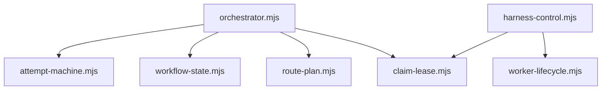
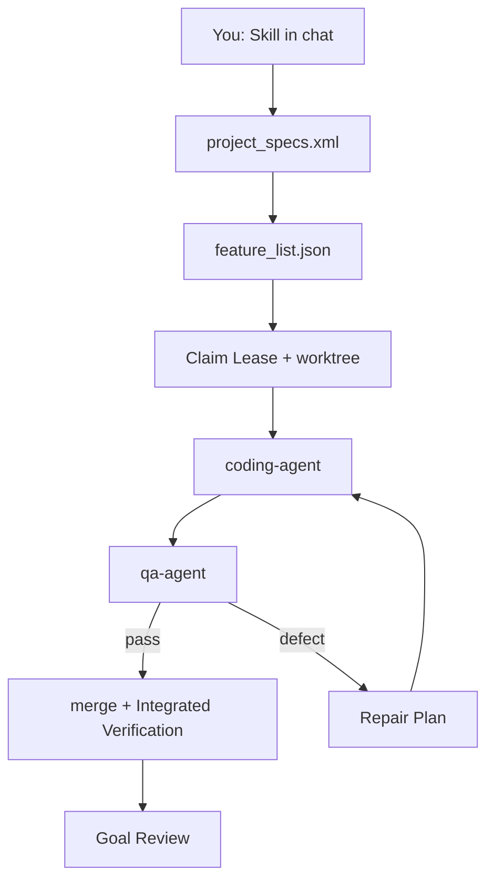

<p align="center">
  
</p>

<p align="center">
  <a href="https://github.com/vinicius91carvalho/harness-engineering/releases/latest"></a>
  <a href="https://github.com/vinicius91carvalho/harness-engineering"></a>
</p>

<p align="center"><b>Turn a goal into checked work — with proof it still works after you close the chat.</b></p>

## About

`harness-engineering` is a plugin marketplace plus a **spec → build → QA → Goal Review** workflow.
The harness owns completion policy; [Claude Code](https://code.claude.com/docs/en/overview), [Codex](https://developers.openai.com/codex/), [OpenCode](https://opencode.ai/), [Cursor Agent](https://cursor.com/docs/cli/overview), and [Pi](https://pi.dev/) run it.
Optional [herdr](https://herdr.dev/) shows workers in terminal panes, auto-selected inside a herdr workspace; optional `.harness/roles.json` routes phases to ordered tool/model candidates.

**Done means evidence:** independent QA, integration on the plan branch, and a final Goal Review — not an empty task list.

**Releases are what you install.**
GitHub Releases (`vX.Y.Z`) are the stable plugin payload for remote installs.
The curl one-liner points at `main` only to download `install.sh`; that script then stages the latest release tag (or `--version` / `VERSION` / `HARNESS_INSTALL_REF`).
Without release tags, every remote install would track the moving `main` tip.
A local checkout of this repo is different: `./install.sh` uses the working tree (dev mode).

## Quickstart

**1. Install once in a terminal** ([details](#install)):

```sh
curl -sSL https://raw.githubusercontent.com/vinicius91carvalho/harness-engineering/main/install.sh | sh
```

That URL only fetches the installer from `main`.
The installer then clones the **latest GitHub Release tag** (or a pin — see [Install](#install)).

**2–4. Then type these in your coding tool's chat** ([Claude Code](https://code.claude.com/docs/en/overview), [Codex](https://developers.openai.com/codex/), [OpenCode](https://opencode.ai/), [Cursor Agent](https://cursor.com/docs/cli/overview), or [Pi](https://pi.dev/)) — not in a terminal:

| Step | What you type | What happens |
| --- | --- | --- |
| **2. Plan** | `/harness:planner Build a notes app where a user can publish a note and find it after reloading.` | Grills you one question at a time (ambiguities, trade-offs, edge cases), then writes `project_specs.xml` with `<domain>`, Acceptance Checks, and `<planning_decisions>` |
| **3. Build** | `/harness:generator` | Claims work, codes, QA's, integrates — answer **All** for a new project |
| **4. Know you're done** | Goal Review passes; every Work Item shows `implementation`, `qa`, and `integration` | Not when the chat goes quiet |

**Existing repo, no new feature yet?** Run `/harness:setup` (no arguments) instead of planner.
**Long unattended run?** Use `/harness:supervisor` after planning.

→ **[Complete guide](https://vinicius91carvalho.github.io/harness-engineering/)** — diagrams, worked examples, role routing, herdr, troubleshooting.

## Framework

### Skills (what you invoke)

| Task | Claude Code / Codex | OpenCode | Cursor Agent |
| --- | --- | --- | --- |
| Set up existing code | `/harness:setup` | `/harness-setup` | `/harness-setup` |
| Plan new work | `/harness:planner` | `/harness-planner` | `/harness-planner` |
| Build or resume | `/harness:generator` | `/harness-generator` | `/harness-generator` |
| Review the goal | `/harness:evaluator` | `/harness-evaluator` | `/harness-evaluator` |
| Operate supervisor | `/harness:supervisor` | `/harness-supervisor` | `/harness-supervisor` |
| Capture lessons | `/harness:learning-loop` | `/harness-learning-loop` | `/harness-learning-loop` |
| Back up configuration | `/harness:update-project` | `/harness-update-project` | `/harness-update-project` |

**Grilling** (built into planner): before `/harness:generator` runs, the planner asks one product question at a time about ambiguous requirements (two readers could disagree), architectural trade-offs (two viable approaches), and edge cases (empty input, expired session, not-found, and similar).
Each answer is recorded in `project_specs.xml` under `<planning_decisions>` and proved by Acceptance Checks.
After reconcile, Work Items in `feature_list.json` carry `planning_decision_ids`.
Spec review does not open until the grilling **Ready Gate** passes.
You can also activate grilling directly by asking “grill me.”
Generator bundles `worktree-git-recovery` for narrow git-only fixes in a worktree.

Shared generator libraries live under `skills/generator/lib/` (`claim-lease`, `integrate-checkpoint`, `worker-outcome`, `supervisor-tick`, `workflow-state`, `route-plan`, `worker-lifecycle`, and helpers such as `verdict`, `ready-work-items`, `project-keys`).
The Attempt loop lives in `skills/generator/workflow/attempt-machine.mjs` (orchestrator delegates; supervisor does not own Attempt policy). `runAttemptLoop` takes narrow, named ports (`state`, `queue`, `agent`, `integrate`, `verifyFirst`, `constants`) rather than a flat context bag; the orchestrator wires host adapters into those ports and owns no Attempt/Defect Report/Repair Plan/Checkpoint policy itself.



### Agents (what the orchestrator spawns)

You do not call these directly.
The orchestrator picks them per phase from `agents/` and optional `.harness/roles.json`:

| Agent | Phase | Role |
| --- | --- | --- |
| `initializer` | Scaffold (once) | Queue + `init.sh` + first commit — never implements features |
| `coding-agent` | Code | Implements one Work Item in its worktree |
| `qa-agent` | QA / Integrated Verification | Independent browser or HTTP checks |



See [CONTEXT.md](CONTEXT.md) for the full glossary and bounded contexts.

## How the workflow runs

1. **Specify** — planner grills open product questions, then writes the Project Goal, product vocabulary and bounded contexts under `<domain>`, Acceptance Checks, and `<planning_decisions>` (setup maps an existing repo without grilling a new goal).
2. **Reconcile** — generator maps every check to a Work Item (missing mappings block execution).
3. **Claim** — each ready context gets a lease, branch, worktree, and port.
4. **Build & inspect** — coding-agent implements; qa-agent tests at a real boundary.
5. **Repair** — defects produce evidence + Repair Plan; three Attempts then block for input.
6. **Integrate** — merge the Work Item branch into the plan integration branch (never `main` while the plan is open), rerun checks (Integrated Verification).
7. **Goal Review** — independent pass over the whole spec on the integrated plan branch.

### Key terms

| Term | One line |
| --- | --- |
| Acceptance Check | Observable pass/fail contract in `project_specs.xml` |
| Planning Decision | Grilled answer to an ambiguity, trade-off, or edge case, stored in `<planning_decisions>` and linked to checks |
| Work Item | One catalog entry in immutable `feature_list.json` (progress in Execution Ledger) |
| Context | Group of Work Items built together in one worktree |
| Claim Lease | Heartbeat-proven exclusive ownership of a context |
| Goal Review | Final independent audit of the whole Project Goal |

### Plan integration branch

Large goals must not commit to `main`/`master` while in flight.
Create one plan branch (for example `plan/opensource-docker`) and pin it at the Git root:

```text
.harness/integration-branch
plan/opensource-docker
```

The harness merges each `gen/<project>-<context>` Work Item branch into that plan branch only.
Goal Review runs on the integrated plan branch.
When the plan ships, merge the plan branch to `main` in one deliberate PR — not piecemeal during the run.

Override for a single run with `HARNESS_INTEGRATION_BRANCH=plan/my-feature`.

Retries: **3 Attempts** per Work Item (orchestrator), **5 resume tries** per blocked context (supervisor), **2 Goal Review reopenings** per item before blocking.

## Examples

What a live run looks like in practice: supervisor status in chat, and per-Work-Item agent tabs when herdr is enabled.

### Supervisor status

During a live run the supervisor prints periodic ticks, per-context rows, merge-lock remediation, and worker health.
The same snapshot is available from `harness-control.mjs status`.

<p align="center">
  
</p>

### Agent workers in herdr

Each Work Item opens in its own tab while the supervisor keeps the fleet healthy.
Workers stream live thinking, tool calls, and MCP warmup in the pane.

<p align="center">
  
</p>

## Install

Requires Git, Bash, **[Node.js 18 or newer](https://nodejs.org/)**, `jq`, and one authenticated tool.

```sh
# latest release (default)
curl -sSL https://raw.githubusercontent.com/vinicius91carvalho/harness-engineering/main/install.sh | sh

# pin a release
curl -sSL https://raw.githubusercontent.com/vinicius91carvalho/harness-engineering/main/install.sh | sh -s -- --version v2.1.0
# or: VERSION=v2.1.0 curl -sSL …/main/install.sh | sh
```

`main` in the URL is only the installer bootstrap.
The script resolves the latest `vX.Y.Z` release tag (or your pin via `--version`, `VERSION`, or `HARNESS_INSTALL_REF`) and clones that tag — not the moving `main` tip.
A local checkout of this repository installs from the working tree instead (dev mode).

Arrow-key checklist: keep `harness` checked; add MCP or extras if you want them.
Windows: [`install.ps1`](install.ps1). Details: [installer docs](docs/installer/README.md).

## Start a project

| You have… | Start with |
| --- | --- |
| A new idea / new product goal | `/harness:planner <goal>` |
| An existing repo + a new goal to build | `/harness:planner <goal>` (existing-codebase mode) |
| An existing working app, just adopting the harness (no new goal) | `/harness:setup` (no args) |
| A reviewed `project_specs.xml`, ready to build/resume | `/harness:generator` |
| A long unattended run with monitoring/pause/resume | `/harness:supervisor` |
| To independently re-audit an already-integrated integration branch | `/harness:evaluator` |

### New project

```text
/harness:planner Build a notes app where a user can publish a note and find it after reloading.
/harness:generator
```

Choose **All** when generator asks for scope.

### Existing codebase

Run setup **without a goal, feature, scope, or other text**:

```text
/harness:setup
```

Review `project_specs.xml`.
Setup does not require a generator run.
To audit selected behavior later, run `/harness:generator` and pick one task or a set.

### Add a feature

```text
/harness:planner Add reversible note archiving.
/harness:generator
```

Select only the new context when generator lists unbuilt work.

## Files delivered

| Path | Meaning |
| --- | --- |
| `project_specs.xml` | Project Goal, `<domain>` (glossary + bounded contexts), Acceptance Checks, and grilled `<planning_decisions>` |
| `feature_list.json` | Immutable Work Item catalog (reconciled from Acceptance Checks; each item may list `planning_decision_ids`) |
| `.git/harness-ledger/` | Execution Ledger: mutable implementation, QA, integration, Attempt, Blocking Scope |
| `harness-progress/` | Human-readable Workflow Journals |
| `.git/harness-runs/` | Run State and worker results per context |
| `.git/harness-evidence/` | Create-only Evidence Artifacts (screenshots, HTTP, logs) |
| `.git/harness-control/` | Control Journal (append-only events), supervisor lease, Resource Governor quota |

* `implementation` means coding completed.
* `qa` means isolated QA passed.
* `integration` means the behavior passed after merging.

### Example: `project_specs.xml`

The specification is the completion contract: stable Acceptance Checks that define what "done" means, product vocabulary under `<domain>` so agents share one language, plus grilled `<planning_decisions>` so product questions are not left for mid-build chat.

```xml
<project_specification>
  <project_name>Notes</project_name>
  <project_goal>
    Published notes remain available after reload.
  </project_goal>
  <domain>
    <glossary>
      <term name="Note" avoid="Post, Entry">
        A titled body of text owned by a signed-in User.
      </term>
      <term name="User" avoid="Account, Member">
        A person authenticated to create and read their own Notes.
      </term>
    </glossary>
    <bounded_contexts>
      <context name="notes" generator_context="notes">
        <responsibility>Capture, list, and reload Notes for a User.</responsibility>
        <relationships>Standalone context for this MVP.</relationships>
      </context>
    </bounded_contexts>
  </domain>
  <acceptance_checks>
    <acceptance_check
      id="AC-001"
      context="notes"
      category="functional"
      depends_on="">
      <description>
        Publish a note, reload, and observe the same title and text.
      </description>
    </acceptance_check>
    <acceptance_check
      id="AC-002"
      context="notes"
      category="edge-case"
      depends_on="AC-001">
      <description>
        Submit an empty title and observe a validation error with no note created.
      </description>
    </acceptance_check>
  </acceptance_checks>
  <planning_decisions>
    <decision id="D-001" topic="ambiguous-requirement">
      <question>Who can publish a note?</question>
      <options>Anyone; signed-in users only</options>
      <choice>Signed-in users only</choice>
      <rationale>Matches a private notes product.</rationale>
      <acceptance_checks>AC-001</acceptance_checks>
    </decision>
    <decision id="D-002" topic="architectural-tradeoff">
      <question>SQLite file or Postgres container for local MVP?</question>
      <options>SQLite file; Postgres container</options>
      <choice>SQLite file</choice>
      <rationale>Zero-ops local smoke path.</rationale>
      <acceptance_checks>AC-001</acceptance_checks>
    </decision>
    <decision id="D-003" topic="edge-case">
      <question>Empty title on publish?</question>
      <options>Reject with validation; allow untitled</options>
      <choice>Reject with validation</choice>
      <rationale>Prevents blank notes in the list.</rationale>
      <acceptance_checks>AC-002</acceptance_checks>
    </decision>
  </planning_decisions>
</project_specification>
```

### Example: `feature_list.json`

The catalog lists Work Items reconciled from Acceptance Checks.
Progress flags (`implementation`, `qa`, `integration`) are defaults in the catalog; the orchestrator writes live progress to the Execution Ledger and overlays it at read time.
`planning_decision_ids` links each item back to the grilled decisions it proves.

```json
[
  {
    "id": "WI-AC-001",
    "context": "notes",
    "acceptance_checks": ["AC-001"],
    "planning_decision_ids": ["D-001", "D-002"],
    "depends_on": [],
    "implementation": false,
    "qa": false,
    "integration": false
  },
  {
    "id": "WI-AC-002",
    "context": "notes",
    "category": "edge-case",
    "acceptance_checks": ["AC-002"],
    "planning_decision_ids": ["D-003"],
    "depends_on": ["AC-001"],
    "implementation": false,
    "qa": false,
    "integration": false
  }
]
```

Dependencies need `integration:true`; Goal Review still runs afterward.

Monorepos: run setup once at the Git root — it writes `.harness/projects.json` and scopes each app. See the [monorepo guide](https://vinicius91carvalho.github.io/harness-engineering/#monorepo).

## Monitor a run

In chat: `/harness:supervisor` (or `/harness-supervisor` on OpenCode).
See [Examples](#examples) for a live supervisor status screenshot.

Script path (OpenCode install example):

```sh
CONTROL=~/.config/opencode/skills/harness-supervisor/scripts/harness-control.mjs
GEN=~/.config/opencode/skills/harness-generator
PROJECT=/absolute/path/to/project
node "$CONTROL" status --repo "$PROJECT"
```

**Completion requires:** `status: complete`, ledger-merged progress with every Work Item integrated, Goal Review `phase: complete`, and a `run_completed` Control Event.

```sh
node "$GEN/reconcile.mjs" "$PROJECT" --check
jq -e '.progress | (.integrated == .total) and (.total > 0)' <(node "$CONTROL" status --repo "$PROJECT")
node "$CONTROL" events --repo "$PROJECT" --consumer manual-check
```

## Fix strange behavior

```sh
GEN=~/.config/opencode/skills/harness-generator
bash "$GEN/claim.sh" list "$PROJECT"
```

| Symptom | Action |
| --- | --- |
| Build says `blocked` | Review journal + evidence; resume with guidance: `bash "$GEN/claim.sh" resume "$PROJECT" "$CONTEXT" $$ force` |
| Looks done but won't complete | The supervisor is still draining its retry queue (up to 5 attempts per context) — check `status` or answer pending Input Requests |
| Worker crashed / stale lease | Auto-resume after `HARNESS_LEASE_TIMEOUT_SECONDS` (default 60s); `force` only if the owner process is truly dead |
| No progress / workers idle with pending inputs | Context-scoped `input_required` events auto-retry each supervisor tick; if still stuck, check `pendingInputs` and worker logs |
| `status` lists workers but herdr has no tabs | Monorepo bug if cleanup is not project-scoped — each supervisor must only close `worker-<project>-*` tabs |
| Finished tab still open after worker ended | Supervisor closes the worker tab when the shell exits or run state is terminal; reattach live tabs after supervisor restart via `rehydrateHerdrWorkers` |
| Supervisors dead but panes still show workers | Restart all four subproject supervisors; orchestrators survive in panes and `rehydrateHerdrWorkers` reattaches them. Supervisor exit no longer closes herdr panes. |
| `supervisor lease was lost` / supervisors exit mid-run | Lease is re-acquired on the next heartbeat instead of fatal-exiting; tick errors are logged and the loop continues |
| pi `Session terminated…killed` / high swap | Host memory pressure — dockerd + mintlify + parallel docker builds. Restart supervisors with `--max-workers 2 --memory-per-worker-mb 2048 --reserve-memory-mb 2048` |

Full symptom list: [site troubleshooting](https://vinicius91carvalho.github.io/harness-engineering/#troubleshoot).

## Optional: role routing and herdr

Role routing is not required to plan, generate, validate, integrate, or review work.

Copy [`config/roles.example.json`](config/roles.example.json) to `.harness/roles.json` to route coding, validation, repair planning, and Goal Review through ordered tool/model candidates.
Coding stays open-source-first (OpenCode / free models, then Composer, then Claude/Codex rescue).
Validation and Goal Review prefer Composer / Codex / Claude first so http/browser ACs are not stuck on pi (no MCP path).
`reconcile.mjs` stores `observation_method` on Work Items; the orchestrator filters weak harnesses to the end for http/browser QA.
Supervisor `status` exposes `workerHealth` and `mergeLock` so 20-minute polls can see real progress vs merge-lock wait vs stuck.
Pi stays available as a transport for those expensive rescue models; it is not the everyday coding host.

[herdr](https://herdr.dev/) is optional terminal visibility. It's auto-selected when the supervisor starts inside a herdr workspace (`HERDR_ENV=1`) with `herdr` installed; pass `--display background` to force background, or `--display herdr` to force herdr when available.
See [Examples](#examples) for agent workers in a herdr workspace.

In herdr mode each worker gets its own tab named `{taskId} - {role} - {project} - r{retry}` and streams the live agent session (thinking, tool calls, verdicts) via a flushed PTY (`script -f`). For `pi`, the orchestrator uses `--mode json` and formats thinking/tool events in real time. Finished workers close their tabs immediately — you should not see idle shells after a job ends.

Optional [Collie](https://github.com/AltanS/collie) is a herdr plugin for mobile access over Tailscale — watch panes and reply from your phone when the supervisor needs input.

→ [Routing guide](https://vinicius91carvalho.github.io/harness-engineering/#routing) · [Herdr visibility](https://vinicius91carvalho.github.io/harness-engineering/#herdr)

To remove a prior Omnigent install from this machine:

```sh
rm -rf ~/.omnigent
uv tool uninstall omnigent 2>/dev/null || true
```

## Documentation

| Guide | Contents |
| --- | --- |
| [Complete guide](https://vinicius91carvalho.github.io/harness-engineering/) | Full workflow, examples, role routing, herdr |
| [CONTEXT.md](CONTEXT.md) | Ubiquitous language + bounded contexts |
| [Plugins](docs/plugins.md) | Optional integrations |
| [Installer](docs/installer/README.md) | Flags and dry runs |
| [Architecture decisions](docs/adr/) | Why the workflow is designed this way |

Feedback welcome via [issues](https://github.com/vinicius91carvalho/harness-engineering/issues).
