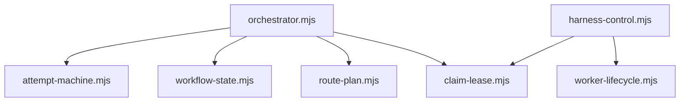
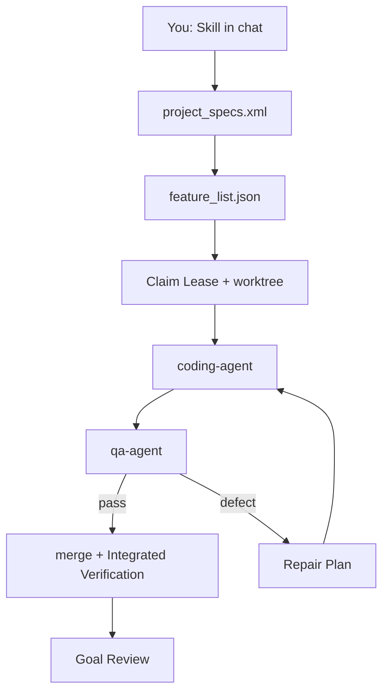

<p align="center">
  
</p>

<p align="center">
  <a href="https://github.com/vinicius91carvalho/harness-engineering/releases/latest"></a>
  <a href="https://github.com/vinicius91carvalho/harness-engineering"></a>
</p>

<p align="center"><b>Turn a goal into checked work — with proof it still works after you close the chat.</b></p>

## Quickstart

**1. Install once in a terminal** ([details](#install)):

```sh
curl -sSL https://raw.githubusercontent.com/vinicius91carvalho/harness-engineering/main/install.sh | sh
```

**2–4. Then type these in your coding tool's chat** ([Claude Code](https://code.claude.com/docs/en/overview), [Codex](https://developers.openai.com/codex/), [OpenCode](https://opencode.ai/), [Cursor Agent](https://cursor.com/docs/cli/overview), or [Pi](https://pi.dev/)) — not in a terminal:

| Step | What you type | What happens |
| --- | --- | --- |
| **2. Plan** | `/harness:planner Build a notes app where a user can publish a note and find it after reloading.` | Writes `project_specs.xml` with Acceptance Checks |
| **3. Build** | `/harness:generator` | Claims work, codes, QA's, integrates — answer **All** for a new project |
| **4. Know you're done** | Goal Review passes; every Work Item shows `implementation`, `qa`, and `integration` | Not when the chat goes quiet |

**Existing repo, no new feature yet?** Run `/harness:setup` (no arguments) instead of planner.
**Long unattended run?** Use `/harness:supervisor` after planning.

→ **[Complete guide](https://vinicius91carvalho.github.io/harness-engineering/)** — diagrams, worked examples, role routing, herdr, troubleshooting.

## About

`harness-engineering` is a plugin marketplace plus a **spec → build → QA → Goal Review** workflow.
The harness owns completion policy; [Claude Code](https://code.claude.com/docs/en/overview), [Codex](https://developers.openai.com/codex/), [OpenCode](https://opencode.ai/), [Cursor Agent](https://cursor.com/docs/cli/overview), and [Pi](https://pi.dev/) run it.
Optional [herdr](https://herdr.dev/) shows workers in terminal panes, auto-selected inside a herdr workspace; optional `.harness/roles.json` routes phases to ordered tool/model candidates.

**Done means evidence:** independent QA, integration on the plan branch, and a final Goal Review — not an empty task list.

## Framework

### Skills (what you invoke)

| Task | Claude Code / Codex | OpenCode | Cursor Agent |
| --- | --- | --- | --- |
| Set up existing code | `/harness:setup` | `/harness-setup` | `/harness-setup` |
| Plan new work | `/harness:planner` | `/harness-planner` | `/harness-planner` |
| Build or resume | `/harness:generator` | `/harness-generator` | `/harness-generator` |
| Review the goal | `/harness:evaluator` | `/harness-evaluator` | `/harness-evaluator` |
| Operate supervisor | `/harness:supervisor` | `/harness-supervisor` | `/harness-supervisor` |
| Capture lessons | `/harness:learning-loop` | `/harness-learning-loop` | `/harness-learning-loop` |
| Back up configuration | `/harness:update-project` | `/harness-update-project` | `/harness-update-project` |

Planner uses grilling internally; activate it by asking “grill me.”
Generator bundles `worktree-git-recovery` for narrow git-only fixes in a worktree.

Shared generator libraries live under `skills/generator/lib/` (`claim-lease`, `integrate-checkpoint`, `worker-outcome`, `supervisor-tick`, `workflow-state`, `route-plan`, `worker-lifecycle`, and helpers such as `verdict`, `ready-work-items`, `project-keys`).
The Attempt loop lives in `skills/generator/workflow/attempt-machine.mjs` (orchestrator delegates; supervisor does not own Attempt policy). `runAttemptLoop` takes narrow, named ports (`state`, `queue`, `agent`, `integrate`, `verifyFirst`, `constants`) rather than a flat context bag; the orchestrator wires host adapters into those ports and owns no Attempt/Defect Report/Repair Plan/Checkpoint policy itself.



### Agents (what the orchestrator spawns)

You do not call these directly.
The orchestrator picks them per phase from `agents/` and optional `.harness/roles.json`:

| Agent | Phase | Role |
| --- | --- | --- |
| `initializer` | Scaffold (once) | Queue + `init.sh` + first commit — never implements features |
| `coding-agent` | Code | Implements one Work Item in its worktree |
| `qa-agent` | QA / Integrated Verification | Independent browser or HTTP checks |



See [CONTEXT.md](CONTEXT.md) for the full glossary and bounded contexts.

## How the workflow runs

1. **Specify** — planner or setup writes the Project Goal and Acceptance Checks.
2. **Reconcile** — generator maps every check to a Work Item (missing mappings block execution).
3. **Claim** — each ready context gets a lease, branch, worktree, and port.
4. **Build & inspect** — coding-agent implements; qa-agent tests at a real boundary.
5. **Repair** — defects produce evidence + Repair Plan; three Attempts then block for input.
6. **Integrate** — merge the Work Item branch into the plan integration branch (never `main` while the plan is open), rerun checks (Integrated Verification).
7. **Goal Review** — independent pass over the whole spec on the integrated plan branch.

### Key terms

| Term | One line |
| --- | --- |
| Acceptance Check | Observable pass/fail contract in `project_specs.xml` |
| Work Item | One queue entry in `feature_list.json` |
| Context | Group of Work Items built together in one worktree |
| Claim Lease | Heartbeat-proven exclusive ownership of a context |
| Goal Review | Final independent audit of the whole Project Goal |

### Plan integration branch

Large goals must not commit to `main`/`master` while in flight.
Create one plan branch (for example `plan/opensource-docker`) and pin it at the Git root:

```text
.harness/integration-branch
plan/opensource-docker
```

The harness merges each `gen/<project>-<context>` Work Item branch into that plan branch only.
Goal Review runs on the integrated plan branch.
When the plan ships, merge the plan branch to `main` in one deliberate PR — not piecemeal during the run.

Override for a single run with `HARNESS_INTEGRATION_BRANCH=plan/my-feature`.

Retries: **3 Attempts** per Work Item (orchestrator), **5 resume tries** per blocked context (supervisor), **2 Goal Review reopenings** per item before blocking.

## Install

Requires Git, Bash, **[Node.js 18 or newer](https://nodejs.org/)**, `jq`, and one authenticated tool.

```sh
curl -sSL https://raw.githubusercontent.com/vinicius91carvalho/harness-engineering/main/install.sh | sh
```

The one-liner fetches the installer script from `main`, then that script stages the **latest GitHub Release tag** (not the moving `main` tip).
Override the tag with `VERSION=vX.Y.Z` or `--version vX.Y.Z` (also `HARNESS_INSTALL_REF`).
A local checkout of this repository installs from the working tree instead (dev mode).

Arrow-key checklist: keep `harness` checked; add MCP or extras if you want them.
Windows: [`install.ps1`](install.ps1). Details: [installer docs](docs/installer/README.md).

## Start a project

| You have… | Start with |
| --- | --- |
| A new idea / new product goal | `/harness:planner <goal>` |
| An existing repo + a new goal to build | `/harness:planner <goal>` (existing-codebase mode) |
| An existing working app, just adopting the harness (no new goal) | `/harness:setup` (no args) |
| A reviewed `project_specs.xml`, ready to build/resume | `/harness:generator` |
| A long unattended run with monitoring/pause/resume | `/harness:supervisor` |
| To independently re-audit an already-integrated integration branch | `/harness:evaluator` |

### New project

```text
/harness:planner Build a notes app where a user can publish a note and find it after reloading.
/harness:generator
```

Choose **All** when generator asks for scope.

### Existing codebase

Run setup **without a goal, feature, scope, or other text**:

```text
/harness:setup
```

Review `project_specs.xml`.
Setup does not require a generator run.
To audit selected behavior later, run `/harness:generator` and pick one task or a set.

### Add a feature

```text
/harness:planner Add reversible note archiving.
/harness:generator
```

Select only the new context when generator lists unbuilt work.

## Files delivered

| Path | Meaning |
| --- | --- |
| `project_specs.xml` | Project Goal + Acceptance Checks |
| `feature_list.json` | Work queue + three proof flags per item |
| `harness-progress/` | Human-readable journals |
| `.git/harness-runs/` | Run State, evidence, worker results |
| `.git/harness-control/` | Supervisor state + Control Events |

* `implementation` means coding completed.
* `qa` means isolated QA passed.
* `integration` means the behavior passed after merging.

### Example: `project_specs.xml`

The specification is the completion contract — stable Acceptance Checks that define what "done" means.

```xml
<project_specification>
  <project_name>Notes</project_name>
  <project_goal>
    Published notes remain available after reload.
  </project_goal>
  <acceptance_checks>
    <acceptance_check
      id="AC-001"
      context="notes"
      category="functional"
      depends_on="">
      <description>
        Publish a note, reload, and observe the same title and text.
      </description>
    </acceptance_check>
  </acceptance_checks>
</project_specification>
```

### Example: `feature_list.json`

The queue is execution state plus three proof flags per Work Item (`implementation`, `qa`, `integration`).

```json
[
  {
    "id": "WI-AC-001",
    "context": "notes",
    "acceptance_checks": ["AC-001"],
    "depends_on": [],
    "implementation": false,
    "qa": false,
    "integration": false
  }
]
```

Dependencies need `integration:true`; Goal Review still runs afterward.

Monorepos: run setup once at the Git root — it writes `.harness/projects.json` and scopes each app. See the [monorepo guide](https://vinicius91carvalho.github.io/harness-engineering/#monorepo).

## Monitor a run

In chat: `/harness:supervisor` (or `/harness-supervisor` on OpenCode).

Script path (OpenCode install example):

```sh
CONTROL=~/.config/opencode/skills/harness-supervisor/scripts/harness-control.mjs
PROJECT=/absolute/path/to/project
node "$CONTROL" status --repo "$PROJECT"
```

**Completion requires:** `status: complete`, all queue flags true, Goal Review `phase: complete`, and a `run_completed` Control Event.

```sh
jq 'all(.[]; .implementation and .qa and .integration)' "$PROJECT/feature_list.json"
node "$CONTROL" events --repo "$PROJECT" --consumer manual-check
```

## Fix strange behavior

```sh
GEN=~/.config/opencode/skills/harness-generator
bash "$GEN/claim.sh" list "$PROJECT"
```

| Symptom | Action |
| --- | --- |
| Build says `blocked` | Review journal + evidence; resume with guidance: `bash "$GEN/claim.sh" resume "$PROJECT" "$CONTEXT" $$ force` |
| Looks done but won't complete | The supervisor is still draining its retry queue (up to 5 attempts per context) — check `status` or answer pending Input Requests |
| Worker crashed / stale lease | Auto-resume after `HARNESS_LEASE_TIMEOUT_SECONDS` (default 60s); `force` only if the owner process is truly dead |

Full symptom list: [site troubleshooting](https://vinicius91carvalho.github.io/harness-engineering/#troubleshoot).

## Optional: role routing and herdr

Role routing is not required to plan, generate, validate, integrate, or review work.

Copy [`config/roles.example.json`](config/roles.example.json) to `.harness/roles.json` to route coding, validation, repair planning, and Goal Review through ordered tool/model candidates.
The example is open-source-first: OpenCode Go and NVIDIA NIM volume models first, then OpenRouter free Qwen Coder, Cursor Composer / Grok when work gets hard, and Claude Opus / GPT-5.5 only as late rescue for stuck bugs.
Pi stays available as a transport for those expensive rescue models; it is not the everyday coding host.

[herdr](https://herdr.dev/) is optional terminal visibility. It's auto-selected when the supervisor starts inside a herdr workspace (`HERDR_ENV=1`) with `herdr` installed; pass `--display background` to force background, or `--display herdr` to force herdr when available.

→ [Routing guide](https://vinicius91carvalho.github.io/harness-engineering/#routing) · [Herdr visibility](https://vinicius91carvalho.github.io/harness-engineering/#herdr)

To remove a prior Omnigent install from this machine:

```sh
rm -rf ~/.omnigent
uv tool uninstall omnigent 2>/dev/null || true
```

## Documentation

| Guide | Contents |
| --- | --- |
| [Complete guide](https://vinicius91carvalho.github.io/harness-engineering/) | Full workflow, examples, role routing, herdr |
| [CONTEXT.md](CONTEXT.md) | Ubiquitous language + bounded contexts |
| [Plugins](docs/plugins.md) | Optional integrations |
| [Installer](docs/installer/README.md) | Flags and dry runs |
| [Architecture decisions](docs/adr/) | Why the workflow is designed this way |

Feedback welcome via [issues](https://github.com/vinicius91carvalho/harness-engineering/issues).
