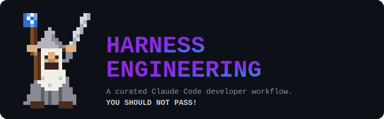
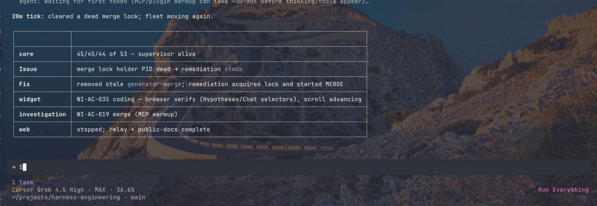
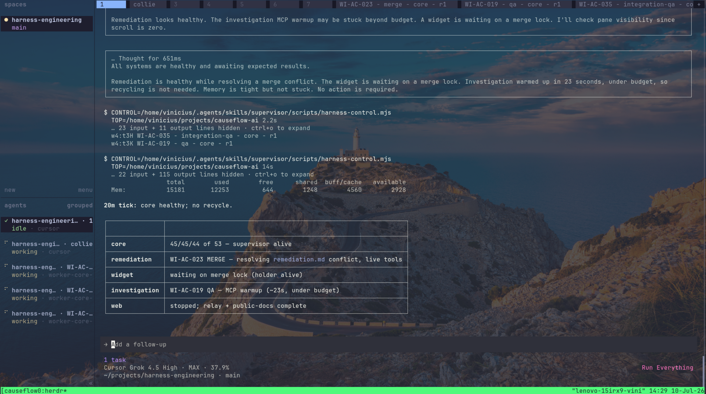
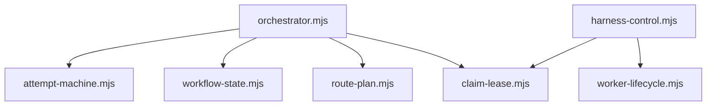
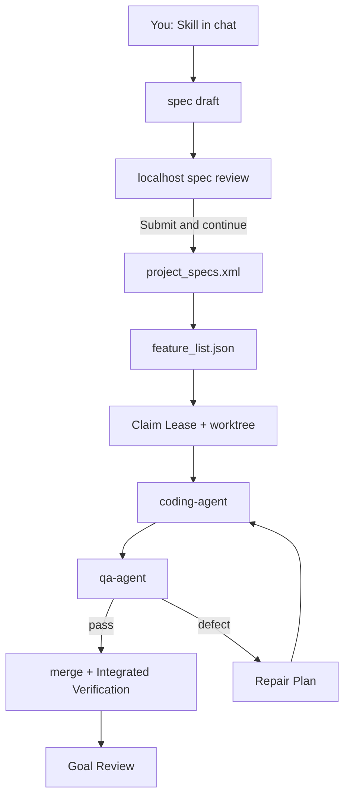

<p align="center">
  
</p>

<p align="center">
  <a href="https://github.com/vinicius91carvalho/harness-engineering/releases/latest"></a>
  <a href="https://github.com/vinicius91carvalho/harness-engineering"></a>
</p>

<p align="center"><b>Turn a goal into checked work — with proof it still works after you close the chat.</b></p>

## About

`harness-engineering` is a plugin marketplace plus a **spec → build → QA → Goal Review** workflow.
The harness owns completion policy; [Claude Code](https://code.claude.com/docs/en/overview), [Codex](https://developers.openai.com/codex/), [OpenCode](https://opencode.ai/), [Cursor Agent](https://cursor.com/docs/cli/overview), and [Pi](https://pi.dev/) run it.
Optional [`.harness/roles.json`](config/roles.example.json) routes phases to ordered tool/model candidates.
Workers always run in the background.

**Done means evidence:** independent QA, integration on the plan branch, and a final Goal Review — not an empty task list.

**Releases are what you install.**
GitHub Releases (`vX.Y.Z`) are the stable plugin payload for remote installs.
The curl one-liner points at `main` only to download `install.sh`; that script then stages the latest release tag (or `--version` / `VERSION` / `HARNESS_INSTALL_REF`).
Without release tags, every remote install would track the moving `main` tip.
A local checkout of this repo is different: `./install.sh` uses the working tree (dev mode).

## Examples

What a live CauseFlow-style monorepo run looks like: supervisor ticks in chat, background Work Item workers in separate panes, and the same bearings from `harness-control status`.

Canonical monitoring is scripted (`harness-control status`, `fleet-snapshot`, logs under `.git/harness-control/<project>/logs/`).
The screenshots below are chat / optional multi-pane UI - not the CLI JSON itself.

### Supervisor status

During a live run the supervisor prints periodic ticks: per-context rows, merge-lock remediation, and worker health.
`harness-control.mjs status` returns that same snapshot as JSON, independent of which chat host you use.

<p align="center">
  
</p>

### Agent workers (background)

Each Work Item runs as a background orchestrator process.
Day-to-day monitoring is `harness-control status`, `fleet-snapshot`, and worker logs under `.git/harness-control/<project>/logs/`.
The screenshot is an optional multi-pane terminal workspace (herdr) with the supervisor chat plus worker tabs - useful for ops, not required by the harness.

<p align="center">
  
</p>

### Real project: CauseFlow AI

[CauseFlow AI](https://github.com/vinicius91carvalho/causeflow-ai) is a real multi-app monorepo (`core`, `web`, `relay`, `public-docs`) that was migrated to a fully open-source, Docker-runnable stack through this harness end to end.
The operator used **planner**, **setup**, **supervisor**, **generator**, and **monorepo-supervisor-ops** to remove AWS, Stripe, Clerk, and other SaaS dependencies, add `docker compose`, ship the marketing site to GitHub Pages, and drive real dashboard E2E against Core.
The full operator brief - goal locks, sync playbook, cadence, closeout, and a day-by-day status log - is archived in [`examples/causeflow-ai-opensource-omnigent-prompt.md`](examples/causeflow-ai-opensource-omnigent-prompt.md) as a template you can adapt for your own monorepo goals.
Delivery completed **2026-07-12** with all four subprojects at `run_completed`.

## Quickstart

**1. Install once in a terminal** ([details](#install)):

```sh
curl -sSL https://raw.githubusercontent.com/vinicius91carvalho/harness-engineering/main/install.sh | sh
```

That URL only fetches the installer from `main`.
The installer then clones the **latest GitHub Release tag** (or a pin — see [Install](#install)).

**2–4. Then type these in your coding tool's chat** ([Claude Code](https://code.claude.com/docs/en/overview), [Codex](https://developers.openai.com/codex/), [OpenCode](https://opencode.ai/), [Cursor Agent](https://cursor.com/docs/cli/overview), or [Pi](https://pi.dev/)) — not in a terminal:

| Step | What you type | What happens |
| --- | --- | --- |
| **2. Plan** | `/harness:planner Build a notes app where a user can publish a note and find it after reloading.` | Grills you one question at a time (ambiguities, trade-offs, edge cases), opens a blocking spec review until you submit, then writes `project_specs.xml` with `<domain>`, Acceptance Checks, and `<planning_decisions>` |
| **3. Build** | `/harness:generator` | Claims work, codes, QA's, integrates — answer **All** for a new project |
| **4. Know you're done** | Goal Review passes; every Work Item shows `implementation`, `qa`, and `integration` | Not when the chat goes quiet |

**Existing repo, no new feature yet?** Run `/harness:setup` (no arguments) instead of planner.
**Long unattended run?** Use `/harness:supervisor` after planning.

→ **[Complete guide](https://vinicius91carvalho.github.io/harness-engineering/)** — diagrams, worked examples, role routing, troubleshooting.

## Framework

### Skills (what you invoke)

| Task | Claude Code / Codex | OpenCode | Cursor (agent/cursor) |
| --- | --- | --- | --- |
| Set up existing code | `/harness:setup` | `/harness-setup` | `/harness-setup` |
| Plan new work | `/harness:planner` | `/harness-planner` | `/harness-planner` |
| Build or resume | `/harness:generator` | `/harness-generator` | `/harness-generator` |
| Review the goal | `/harness:evaluator` | `/harness-evaluator` | `/harness-evaluator` |
| Operate supervisor | `/harness:supervisor` | `/harness-supervisor` | `/harness-supervisor` |
| Capture lessons | `/harness:learning-loop` | `/harness-learning-loop` | `/harness-learning-loop` |
| Back up configuration | `/harness:update-project` | `/harness-update-project` | `/harness-update-project` |

**Grilling** (built into planner): before `/harness:generator` runs, the planner asks one product question at a time about ambiguous requirements (two readers could disagree), architectural trade-offs (two viable approaches), and edge cases (empty input, expired session, not-found, and similar).
Each answer is recorded in the spec draft under `<planning_decisions>` and proved by Acceptance Checks.
After reconcile, Work Items in `feature_list.json` carry `planning_decision_ids`.
Spec review does not open until the grilling **Ready Gate** passes; `project_specs.xml` is written only after you submit.
You can also activate grilling directly by asking “grill me.”
Generator bundles `worktree-git-recovery` for narrow git-only fixes in a worktree.



### Agents (what the orchestrator spawns)

You do not call these directly.
The orchestrator picks them per phase from `agents/` and optional `.harness/roles.json`:

| Agent | Phase | Role |
| --- | --- | --- |
| `initializer` | Scaffold (once) | Queue + `init.sh` from `skills/generator/templates/init.sh` (`start|stop|restart|status|help`) + first commit - never implements features |
| `coding-agent` | Code | Implements one Work Item in its worktree |
| `qa-agent` | QA / Integrated Verification | Independent browser or HTTP checks |



See [CONTEXT.md](CONTEXT.md) for the full glossary and bounded contexts.

## How the workflow runs

1. **Specify** — planner grills open product questions, opens a localhost spec review until you submit, then writes the Project Goal, product vocabulary and bounded contexts under `<domain>`, Acceptance Checks, and `<planning_decisions>` (setup maps an existing repo without grilling a new goal); finalize also registers the project in `.harness/projects.json` and pins `.harness/integration-branch` when none exists yet.
2. **Reconcile** — generator maps every check to a Work Item (missing mappings block execution); it resolves `PROJECT` itself, walking up from the working directory for the nearest `project_specs.xml` and falling back to `.harness/projects.json`, so a fresh session run from anywhere in the repo finds the plan.
3. **Claim** — each ready context gets a lease, branch, worktree, and port.
4. **Build & inspect** — coding-agent implements; qa-agent tests at a real boundary.
5. **Repair** — defects produce evidence + Repair Plan; three Attempts then block for input.
6. **Integrate** — merge the Work Item branch into the plan integration branch (never `main` while the plan is open), rerun checks (Integrated Verification).
7. **Goal Review** — independent pass over the whole spec on the integrated plan branch.

### Key terms

| Term | One line |
| --- | --- |
| Acceptance Check | Observable pass/fail contract in `project_specs.xml` |
| Planning Decision | Grilled answer to an ambiguity, trade-off, or edge case, stored in `<planning_decisions>` and linked to checks |
| Work Item | One catalog entry in immutable `feature_list.json` (progress in Execution Ledger) |
| Context | Group of Work Items built together in one worktree |
| Claim Lease | Heartbeat-proven exclusive ownership of a context |
| Goal Review | Final independent audit of the whole Project Goal |

### Plan integration branch

Large goals must not commit to `main`/`master` while in flight.
Create one plan branch (for example `plan/opensource-docker`) and pin it at the Git root:

```text
.harness/integration-branch
plan/opensource-docker
```

Planner `finalize` creates this pin automatically (`plan/<slug>`, derived from the project name) whenever none exists yet, so most goals never need this step by hand.
The harness merges each `gen/<project>-<context>` Work Item branch into that plan branch only.
Goal Review runs on the integrated plan branch.
Integration checkouts live in one Git-root sibling worktree per plan branch (`<gitRoot>-wt-integration`); a subproject uses its own prefix subdirectory inside it rather than a separate worktree.
When the plan ships, merge the plan branch to `main` in one deliberate PR — not piecemeal during the run.

Override for a single run with `HARNESS_INTEGRATION_BRANCH=plan/my-feature`.

Retries: **3 Attempts** per Work Item (orchestrator), **5 resume tries** per blocked context (supervisor), **2 Goal Review reopenings** per item before blocking.

## Install

Requires Git, Bash, **[Node.js 18 or newer](https://nodejs.org/)**, `jq` (not auto-installed), and one authenticated tool.

**v3.0 is a clean break.**
There is no mid-flight migration from 2.x.
Remove the previous harness install (plugin/skills under your host’s user or project dirs), then install 3.x fresh.
Control modules live only under `skills/supervisor/lib/`; herdr runtime helpers are gone (optional herdr UI for ops is still fine).

```sh
# latest release, user (global) scope (default)
curl -sSL https://raw.githubusercontent.com/vinicius91carvalho/harness-engineering/main/install.sh | sh

# pin a release
curl -sSL https://raw.githubusercontent.com/vinicius91carvalho/harness-engineering/main/install.sh | sh -s -- --version v3.0.0
# or: VERSION=v3.0.0 curl -sSL …/main/install.sh | sh

# install into a specific project folder (paths depend on --cli)
cd /path/to/app
curl -sSL https://raw.githubusercontent.com/vinicius91carvalho/harness-engineering/main/install.sh | sh -s -- --cli opencode --scope project --project-dir .
```

`main` in the URL is only the installer bootstrap.
The script resolves the latest `vX.Y.Z` release tag (or your pin via `--version`, `VERSION`, or `HARNESS_INSTALL_REF`) and clones that tag - not the moving `main` tip.
A local checkout of this repository installs from the working tree instead (dev mode).

Interactively the installer asks for host (Claude, Codex, OpenCode, Pi, agent/cursor), then install scope (`user` global vs `project` folder; Claude also offers `local`), then the checklist.
For Cursor, harness lands as a local plugin under `.cursor/plugins/local/harness/` (IDE) and links each skill into `.cursor/skills/` so the `agent` CLI slash menu can see `/supervisor` and the rest.
`--scope` / `--project-dir` (PowerShell: `-Scope` / `-ProjectDir`) skip the scope menu.
Arrow-key checklist: keep `harness` checked; add MCP or extras if you want them.
User-only modules (`status-line`, `shared-config`, `treehouse`) are skipped for project scope.
The optional status line reads the CLI payload once per render, shows 5h and 7d renew countdowns when reset timestamps are present, and only enumerates linked Git worktrees when the repo actually has a worktree registry.
Windows: [`install.ps1`](install.ps1). Details: [installer docs](docs/installer/README.md).

## Start a project

| You have… | Start with |
| --- | --- |
| A new idea / new product goal | `/harness:planner <goal>` |
| An existing repo + a new goal to build | `/harness:planner <goal>` (existing-codebase mode) |
| An existing working app, just adopting the harness (no new goal) | `/harness:setup` (no args) |
| A reviewed `project_specs.xml`, ready to build/resume | `/harness:generator` |
| A long unattended run with monitoring/pause/resume | `/harness:supervisor` |
| To independently re-audit an already-integrated integration branch | `/harness:evaluator` |

### New project

```text
/harness:planner Build a notes app where a user can publish a note and find it after reloading.
/harness:generator
```

Choose **All** when generator asks for scope.

### Existing codebase

Run setup **without a goal, feature, scope, or other text**:

```text
/harness:setup
```

Review `project_specs.xml`.
Setup does not require a generator run.
To audit selected behavior later, run `/harness:generator` and pick one task or a set.

### Add a feature

```text
/harness:planner Add reversible note archiving.
/harness:generator
```

Select only the new context when generator lists unbuilt work.

## Files delivered

| Path | Meaning |
| --- | --- |
| `project_specs.xml` | Project Goal, `<domain>` (glossary + bounded contexts), Acceptance Checks, and grilled `<planning_decisions>` |
| `feature_list.json` | Immutable Work Item catalog (reconciled from Acceptance Checks; each item may list `planning_decision_ids`) |
| `.git/harness-ledger/` | Execution Ledger: mutable implementation, QA, integration, Attempt, Blocking Scope |
| `harness-progress/` | Human-readable Workflow Journals |
| `.git/harness-runs/` | Run State and worker results per context |
| `.git/harness-evidence/` | Create-only Evidence Artifacts (screenshots, HTTP, logs) |
| `.git/harness-control/` | Control Journal (append-only events), supervisor lease, Resource Governor quota |

* `implementation` means coding completed.
* `qa` means isolated QA passed.
* `integration` means the behavior passed after merging.

### Example: `project_specs.xml`

The specification is the completion contract: stable Acceptance Checks that define what "done" means, product vocabulary under `<domain>` so agents share one language, plus grilled `<planning_decisions>` so product questions are not left for mid-build chat.

```xml
<project_specification>
  <project_name>Notes</project_name>
  <project_goal>
    Published notes remain available after reload.
  </project_goal>
  <domain>
    <glossary>
      <term name="Note" avoid="Post, Entry">
        A titled body of text owned by a signed-in User.
      </term>
      <term name="User" avoid="Account, Member">
        A person authenticated to create and read their own Notes.
      </term>
    </glossary>
    <bounded_contexts>
      <context name="notes" generator_context="notes">
        <responsibility>Capture, list, and reload Notes for a User.</responsibility>
        <relationships>Standalone context for this MVP.</relationships>
      </context>
    </bounded_contexts>
  </domain>
  <acceptance_checks>
    <acceptance_check
      id="AC-001"
      context="notes"
      category="functional"
      depends_on="">
      <description>
        Publish a note, reload, and observe the same title and text.
      </description>
    </acceptance_check>
    <acceptance_check
      id="AC-002"
      context="notes"
      category="edge-case"
      depends_on="AC-001">
      <description>
        Submit an empty title and observe a validation error with no note created.
      </description>
    </acceptance_check>
  </acceptance_checks>
  <planning_decisions>
    <decision id="D-001" topic="ambiguous-requirement">
      <question>Who can publish a note?</question>
      <options>Anyone; signed-in users only</options>
      <choice>Signed-in users only</choice>
      <rationale>Matches a private notes product.</rationale>
      <acceptance_checks>AC-001</acceptance_checks>
    </decision>
    <decision id="D-002" topic="architectural-tradeoff">
      <question>SQLite file or Postgres container for local MVP?</question>
      <options>SQLite file; Postgres container</options>
      <choice>SQLite file</choice>
      <rationale>Zero-ops local smoke path.</rationale>
      <acceptance_checks>AC-001</acceptance_checks>
    </decision>
    <decision id="D-003" topic="edge-case">
      <question>Empty title on publish?</question>
      <options>Reject with validation; allow untitled</options>
      <choice>Reject with validation</choice>
      <rationale>Prevents blank notes in the list.</rationale>
      <acceptance_checks>AC-002</acceptance_checks>
    </decision>
  </planning_decisions>
</project_specification>
```

### Example: `feature_list.json`

The catalog lists Work Items reconciled from Acceptance Checks.
Progress flags (`implementation`, `qa`, `integration`) are defaults in the catalog; the orchestrator writes live progress to the Execution Ledger and overlays it at read time.
`planning_decision_ids` links each item back to the grilled decisions it proves.

```json
[
  {
    "id": "WI-AC-001",
    "context": "notes",
    "acceptance_checks": ["AC-001"],
    "planning_decision_ids": ["D-001", "D-002"],
    "depends_on": [],
    "implementation": false,
    "qa": false,
    "integration": false
  },
  {
    "id": "WI-AC-002",
    "context": "notes",
    "category": "edge-case",
    "acceptance_checks": ["AC-002"],
    "planning_decision_ids": ["D-003"],
    "depends_on": ["AC-001"],
    "implementation": false,
    "qa": false,
    "integration": false
  }
]
```

Dependencies need `integration:true`; Goal Review still runs afterward.

Monorepos: run setup once at the Git root.
Boundary detection is candidates-only until you confirm; then it registers selected projects in `.harness/projects.json`.
A goal that spans multiple registered projects anchors `project_specs.xml` at the Git root instead of one subproject, with each Acceptance Check naming the subproject it changes.
See the [monorepo guide](https://vinicius91carvalho.github.io/harness-engineering/#monorepo).

## Monitor a run

In chat: `/harness:supervisor` (or `/harness-supervisor` on OpenCode).
See [Examples](#examples) for live-run screenshots (chat ticks and an optional multi-pane workspace).
Poll the same bearings with `harness-control status` below.

Script path (OpenCode install example):

```sh
CONTROL=~/.config/opencode/skills/harness-supervisor/scripts/harness-control.mjs
GEN=~/.config/opencode/skills/harness-generator
PROJECT=/absolute/path/to/project
node "$CONTROL" status --repo "$PROJECT"
```

**Completion requires:** `status: complete`, ledger-merged progress with every Work Item integrated, Goal Review `phase: complete`, and a `run_completed` Control Event.

```sh
node "$GEN/reconcile.mjs" "$PROJECT" --check
jq -e '.progress | (.integrated == .total) and (.total > 0)' <(node "$CONTROL" status --repo "$PROJECT")
node "$CONTROL" events --repo "$PROJECT" --consumer manual-check
```

## Fix strange behavior

```sh
GEN=~/.config/opencode/skills/harness-generator
bash "$GEN/claim.sh" list "$PROJECT"
```

| Symptom | Action |
| --- | --- |
| Build says `blocked` | Review journal + evidence; resume with guidance: `bash "$GEN/claim.sh" resume "$PROJECT" "$CONTEXT" $$ force` |
| Looks done but won't complete | The supervisor is still draining its retry queue (up to 5 attempts per context) — check `status` or answer pending Input Requests |
| Worker crashed / stale lease | Auto-resume after `HARNESS_LEASE_TIMEOUT_SECONDS` (default 60s); `force` only if the owner process is truly dead. Permission-denied PID probes count as live, and Fleet Snapshot ignores worker rows whose recorded PID is dead. |
| No progress / workers idle with pending inputs | Context-scoped `input_required` events auto-retry each supervisor tick; if still stuck, check `pendingInputs`, `workerHealth`, and worker logs under `.git/harness-control/<project>/logs/` |
| `status` lists workers but PIDs are dead | Ghost worker row — restart supervisor; check `fleetSnapshot` and `workerHealth` |
| `supervisor lease was lost` / supervisors exit mid-run | Lease is re-acquired on the next heartbeat instead of fatal-exiting; tick errors are logged and the loop continues |
| pi `Session terminated…killed` / high swap | Host memory pressure from dockerd, docs builds, or parallel browsers. Resource Governor now reports swap pressure and weighted reservations; restart with lower `--max-workers` or higher `--memory-per-worker-mb` only after checking `fleetSnapshot.projects[].hostResources` and `pressureAdvice`. |
| Orphan Docker after finished WIs | Coding/QA must tear down compose/containers they started before the verdict. Shared infra containers stay behind a Shared Runtime Lease; private app containers and owned runtime manifest entries are safe to stop (`docker compose -p … down`, `docker rm -f wi-ac-*` / completed stacks). |

Full symptom list: [site troubleshooting](https://vinicius91carvalho.github.io/harness-engineering/#troubleshoot).

## Optional: role routing

Role routing is not required to plan, generate, validate, integrate, or review work.

Copy [`config/roles.example.json`](config/roles.example.json) to `.harness/roles.json` to route coding, validation, repair planning, and Goal Review through ordered tool/model candidates.
Coding stays open-source-first (OpenCode / free models, then Composer, then Claude/Codex rescue).
Validation and Goal Review prefer Composer / Codex / Claude first so http/browser ACs are not stuck on pi (no MCP path).
`reconcile.mjs` stores `observation_method` on Work Items; the orchestrator filters weak harnesses to the end for http/browser QA.
Supervisor `status` exposes `workerHealth`, `mergeLock`, and Fleet Snapshot resource bearings so 20-minute polls can see real progress vs merge-lock wait vs stuck vs resource pressure.
Pi stays available as a transport for those expensive rescue models; it is not the everyday coding host.
Workers always run in the background. Monitor them with `harness-control status`, worker logs under `.git/harness-control/`, and `fleet-snapshot`.

→ [Routing guide](https://vinicius91carvalho.github.io/harness-engineering/#routing)

To remove a prior Omnigent install from this machine:

```sh
rm -rf ~/.omnigent
uv tool uninstall omnigent 2>/dev/null || true
```

## Documentation

| Guide | Contents |
| --- | --- |
| [Complete guide](https://vinicius91carvalho.github.io/harness-engineering/) | Full workflow, examples, role routing |
| [CONTEXT.md](CONTEXT.md) | Ubiquitous language + bounded contexts |
| [Plugins](docs/plugins.md) | Optional integrations |
| [Installer](docs/installer/README.md) | Flags and dry runs |
| [Architecture decisions](docs/adr/) | Why the workflow is designed this way |

Feedback welcome via [issues](https://github.com/vinicius91carvalho/harness-engineering/issues).
